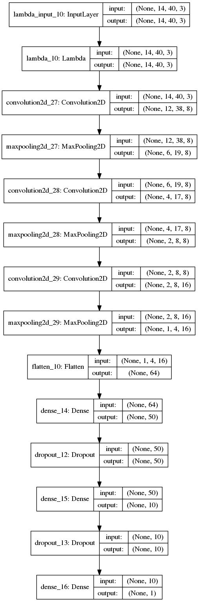
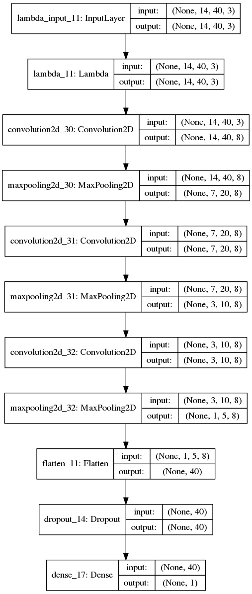
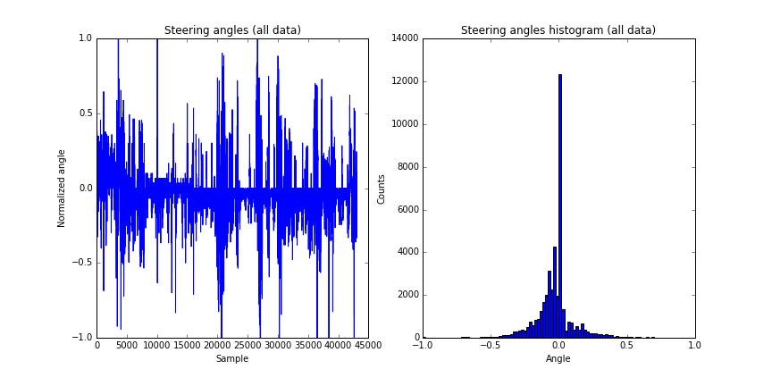
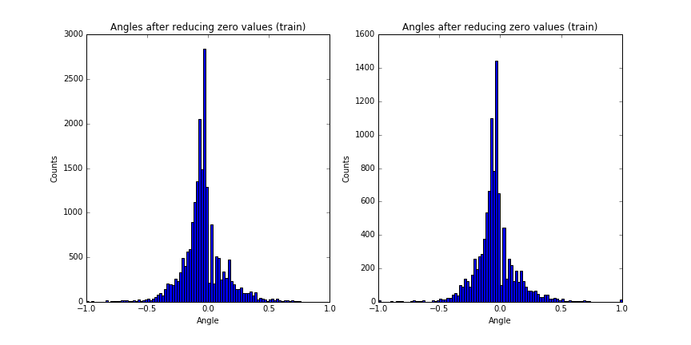

# Behavioral Cloning for Automated Driving Using Deep Convolutional Neural Networks

This repository provides the source codes for a Keras implementation of a deep convolutional neural network (CNN) that 
can learn from a set of demonestrations provided by a human driver 
and autonomously drive a car in a simulated environment.

Two CNN models with significantly different sizes and slightly different performances are trained in this work.
The "larger" model consists of 3/3 Conv/Fully-connected(FC) layers  with 4723 parameters and the "smaller" one has 
3/1 Conv/FC layers with only 217 parameters. Both models can pass several laps successfully but the large model keeps the car closer
to the lane center especially in sharp turns.

#### Prerequisites:
* Python Packages: Keras, TensorFlow, OpenCV, flask, eventlet, python-socketio
* Simulator: Udacity has recently created a car simulator that is used in this work for 
recording demonestrations and validating the trained networks. Running the simulator and 
recording data is very straight forward. Validating the trained model on the simulator is explained below.

#### Running the Pretrained Networks:
In terminal run `python drive.py model.json` to load the large model with
pretrained weights and run it. Similarly, use `python drive.py model_small.json` to run the smaller model. 

Once you get a message like `wsgi starting up on http://0.0.0.0:4567` everything is ready and you can 
launch the simulator to see the car driving in autonomous mode.

#### Training (New) Networks:
`model.py` is the script used to create and train the model. Feel free to 
change the model architectures in `shahnet()` and `shahnet_small()` functions and
then use the following command to train the models:
* To train the large model: in terminal run `python model.py`
* To train the small model: in terminal run `python model.py --model_size small`

**Training Data:** The training data collected from driving the car in the simulator can be found in `./data` directory.
One can use the +41K images available in this dataset, or run the simulator and collect a different set of images and 
steering angles by driving the car and recording the logs.
(acknowledgment: `./data/data_4` is a subset of this [dataset](https://github.com/matthewzimmer/CarND-BehavioralCloning-P3)).

# Method:
#### Model Architecture:
A deep neural network consists of xxx 2D convolutional layers followed by xxx fully connected layers is implemented in `shahnet(image_shape)` function in `model.py`. In order to prevent overfitting each fully connected layers are stacked with a Dropout layer that randomly sets 50% of the input stimula to zero (only) during training. Moreover, MaxPooling layers are placed after the Conv layers to downsample the images over the pipe, decrease the number of trainable parameters and as a result overfitting prevention. After some manual iterations, it turned out that 2x2 max-pooling yields to the best performance along with the othery layers.

  

                                                                                                                               
#### Preprocessing:
* Cropping: 30% of the image from top is cropped out to reduce the image size. This part of the image only shows the sky and does 
not provide any useful information about the road itself. 

* Resizing: All images are resized to 14x40 pixels. The color space (RGB) is not changed.

* Normalization: The intensity of original images is between 0 and 255. These values are linearly transformed to [-0.5, 0.5]
range.

* Reducing zero-angle samples: The time series and histogram of the steering angles in training data is shown in the figure below. 
Since most of the track is straight, there is a large population around zero angle. 

To prevent converging to a model that always predict zero the samples with zero angles are removed from the training data.

#### Splitting Data Between Training and Validation Sets:
Since the consecutive samples are very similar to each other shuffling the data and spliting it into training and validation cause
the training set to have images almost identical to the ones in the validation set. To keep the validation set different from the
training set the samples are first divided into batches of 10 consecutive samples and then 33% of the batches are randomly selected as
the validation set. The histogram of training and validation sets are shown below. Note that the distributions are similar and there is no 
large peak at 0 anymore.

#### Data Augmentation:
Keras has a super helpful data generator function called `ImageDataGenerator`
that can augment the available data with
new images synthesized by applying multiple wellknown transformations on them.
After trying all transformation with different purterbation values the following parameters turned out to work best with
the current architecture and dataset:
* rotation_range: 5 degrees (Degree range for random rotations)
* width_shift_range: 5% (Range for random horizontal shifts)
* height_shift_range: 5% (Range for random vertical shifts)
* zoom_range: 5% (Range for random zoom in/out)

Horizontal Flip:
Image outputs from the Keras generator are flipped horizontally with 50% randomness to increase the number of samples. 
Once an image is fliped, the associated steering angle is multipled by -1 to be consistent with the new image.

Training: Optimizer, callbacks, number of epochs.

### List of Main Files: 
* `model.py` - The script used to create and train the model.
* `drive.py` - The script to drive the car when the simulator is in autonomous mode.
* `model.json` - The "large" model architecture. Saved after running model.py with `--model_size large` input argument.
* `model.h5` - The "large" model parameters. Saved after running model.py with `--model_size large` input argument.
* `model_small.json` - The "small" model architecture. Saved after running model.py with `--model_size small` input argument.
* `model_small.h5` - The "small" model parameters. Saved after running model.py with `--model_size small` input argument.

