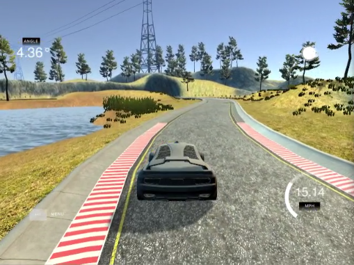
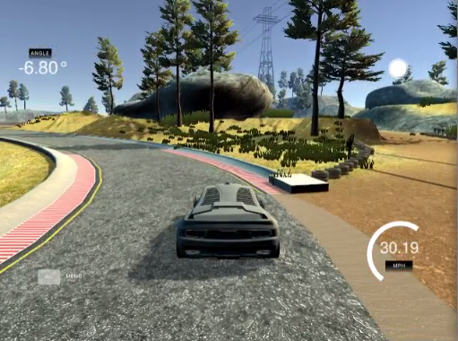
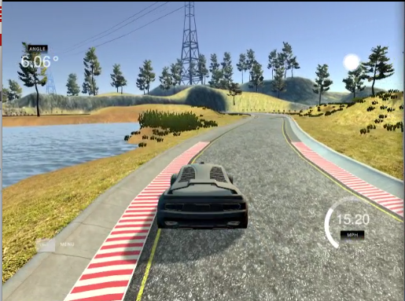
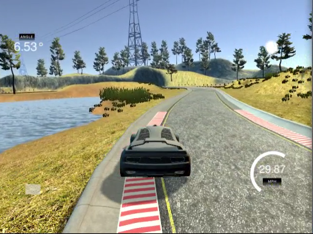
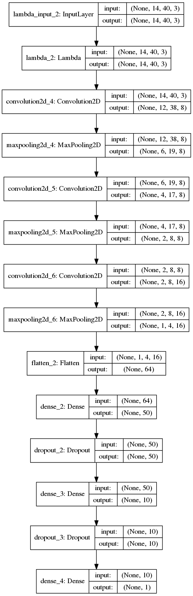
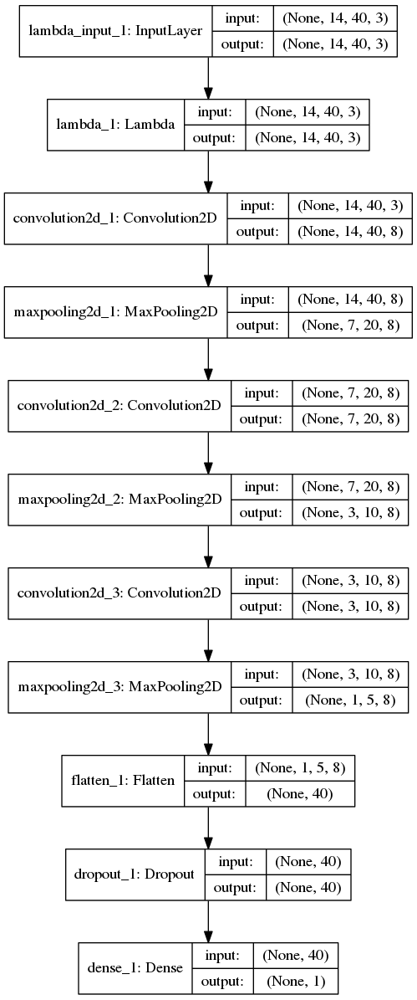
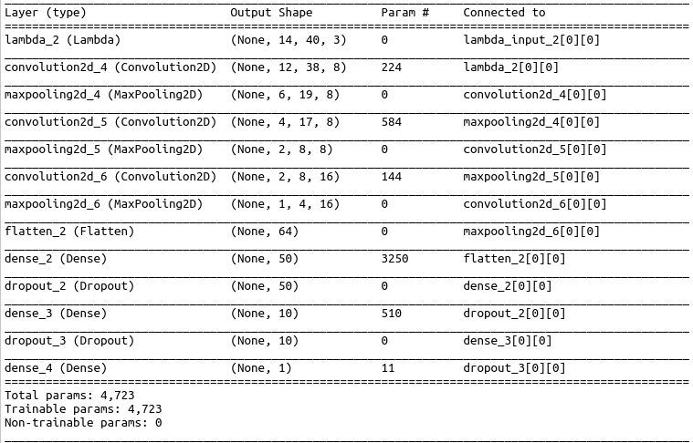
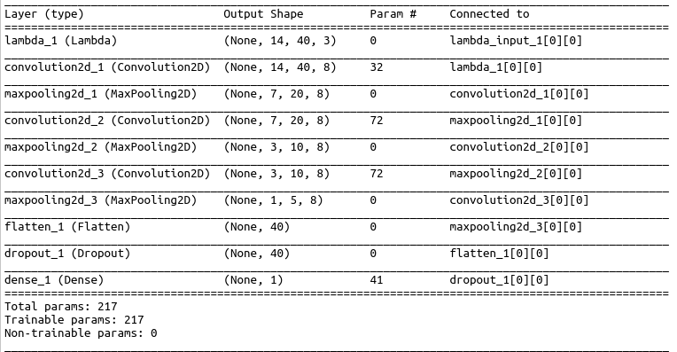

# Behavioral Cloning for Automated Driving Using Deep Convolutional Neural Networks

This repository provides the source codes for a Keras implementation of a deep convolutional neural network (CNN) that can autonomously drive a car in a simulated environment by
learning from a set of demonstrations provided by a human driver -- a task that is commonly known as "Behavioral Cloning".

Two CNN models with significantly different sizes and slightly different performances are trained in this work.
The "larger" model consists of 3/3 Convolutional/Fully-connected(FC) layers  with 4723 parameters and the "smaller" one has 
3/1 Conv/FC layers with only 217 parameters. Both models can pass several laps successfully but the large model keeps the car closer
to the center of the lane especially in sharp turns.
The main motive behind designing the smaller model is to show how the performance degrades as the network gets smaller and also illustrate the power of deep architectures in learning relatively complex tasks by using a small number of parameters. In fact, if we wanted to use a naive fully connected implementation, we had to have at least 561 (14x40+1) parameters to map the resized input image (14x40 pixels) to the output. 

#### Prerequisites:
* Python Packages: Keras, TensorFlow, OpenCV, flask, eventlet, python-socketio
* Simulator: Udacity has recently created a car simulator which is used in this work for 
recording demonstrations and validating the trained networks. Running the simulator and 
recording data is very straight forward. Validating the trained model on the simulator is explained below.

#### Running the Pretrained Networks:
In terminal enter `python drive.py model.json --speed 20` to load the large model with
pretrained weights and drive the car at 20mph. 
Similarly, use `python drive.py model_small.json --speed 30` to run the smaller model at 30mph.

Once you get a message like `wsgi starting up on http://0.0.0.0:4567` everything is ready and you can 
launch the simulator to see the car driving in autonomous mode.

#### Training (New) Networks:
`model.py` is the script used to create and train the model. Feel free to 
change the model architectures in `shahnet()` and `shahnet_small()` functions and
then use the following commands to train the models:
* To train the large model: in terminal run `python model.py`
* To train the small model: in terminal run `python model.py --model_size small`

**Training Data:** The training data collected from driving the car in the simulator can be found in `./data` directory ***only on "data" branch***.
One can use the +41K images available in this dataset, or run the simulator and collect a different set of images and 
steering angles by driving the car and recording the logs. This dataset contains samples of driving on straight tracks and bringing the car back to the center of the lane from a stage that is close to the road sides.
(acknowledgment: `./data/data_4` is a subset of this [dataset](https://github.com/matthewzimmer/CarND-BehavioralCloning-P3)).

#### Summary of Results:
The two deep CNN models that are designed and trained in this project are able to drive through the track successfully and pass several laps. However, the performance in terms of closeness to the center of the lane is different and as expected the deeper model that has 20x more parameters can keep the car farther from the ledges. When the car is being controlled by the small model it enters the road side when making the sharpest turn. As mentioned above, the main motive behind designing this relatively small model was showing how the performance degrades as the network gets smaller and showing the power of deep learning in learning relatively complicated tasks using deep networks with small number of parameters. In fact, if we wanted to use a naive fully connected implementation, we had to have at least 561 (14x40+1) parameters to map the input image (14x40 pixels) to the output.

See the video of the large model driving at 15mph:

See the video of the large model driving at 30mph:

See the video of the smaller model driving at 15mph:

See the video of the smaller model driving at 30mph:

# Method:
#### Model Architecture:
Two deep convolutional neural network architectures are designed and validated in this work. The "large" model can be found in  `shahnet(image_shape)` function and the small one is implemented in  `shahnet_small(image_shape)` inside `model.py`.  Both models consist of three 2D-convolutional layers that are followed by fully connected layers. 
Nonlinearity is introduced in the model by adding "Exponential Linear Unit" (ELU) activations after the Conv layers. It has been shown that ELU activation can speed up learning in deep neural networks and lead to higher accuracies. Like rectified linear units (ReLUs), ELUs also avoid a vanishing gradient via the identity for positive values. However, ELUs have improved learning characteristics compared to the units with other activation functions.

In order to prevent over-fitting each the connected layers are stacked with Dropout layers that randomly sets 50% of the input stimuli to zero (only) during training. Moreover, MaxPooling layers are placed after the Conv layers to down-sample the images over the pipe, decrease the number of trainable parameters and as a result prevent over-fitting. After some manual iterations, it turned out that 2x2 max-pooling yields the best performance along with the other layers. The number of kernels in Conv layers of the large model are respectively 8, 8 and 16, while in the small model they all have 8 kernels. The number of visual features outputted by the stack of Conv layers are respectively 64 and 40 in the large and small models.
In the small model the visual features are directly converted to the steering angle through one fully connected layer followed by a "tanh()" nonlinearity (note that the angles are normalized to the range of -1 and 1). However, in the larger model there are 3 fully connected layers with 50 (ELU), 10 (ELU) and 1 (tanh) output neurons. 

The total number of parameters in the large model is 4723, and in the small model is 217. More details about each layer such as the strides, input/output dimensions and number of parameters can be found in the figures and tables shown below (large network on the left and small one on the right).

  

  

#### Training:
Mean Squared Error of steering angle prediction is used as the loss function and both models are trained using "ADAM" optimizer with learning rate 0.001 and first/second moment coefficients (beta_1/beta_2) equal to 0.9 and 0.999 respectively. 
Models often benefit from reducing the learning rate once learning stagnates. The learning rate is multiplied by 0.8 whenever no improvement in validation loss is seen in the last 10 epochs.
In order to speed up the training and prevent over-fitting due to training over many epochs, an early stopping criterion is considered based on the loss over validation set. That is, after each epoch the weights are saved only if the validation loss was less than the minimum visited so far and the training stops if the validation loss was not improved in the past 20 epochs. The maximum number of epochs is chosen large enough (200) so that the training only stops when the aforementioned criteria are met.
                                                                                                                              
#### Preprocessing:
* Cropping: 30% of the image from top is cropped out to reduce the image size. This part of the image only shows the sky and does 
not provide any useful information about the road itself. 

* Resizing: All images are resized to 14x40 pixels. The color space (RGB) is not changed.

* Normalization: The intensity of original images is between 0 and 255. These values are linearly transformed to [-0.5, 0.5]
range. Since the input data is generated on the fly, the normalization is performed by a `Lambda` layer in TensorFlow to be run on the GPU (as opposed to performing the normalization on the CPU before passing the data to the network).

* Reducing zero-angle samples: The time series and histogram of the steering angles in training data is shown in the figure below. 
Since most of the track is straight, there is a large population around zero angle. 

To prevent converging to a model that always predict zero the samples with zero angles are removed from the training data.

#### Splitting Data Between Training and Validation Sets:
Since the consecutive samples are very similar to each other shuffling the data and spiting it into training and validation cause
the training set to have images almost identical to the ones in the validation set. To keep the validation set different from the
training set the samples are first divided into batches of 10 consecutive samples and then 33% of the batches are randomly selected as
the validation set. The histogram of training and validation sets are shown below. Note that the distributions are similar and there is no 
large peak at 0 anymore.

#### Data Augmentation:
Keras has a super helpful data generator function called `ImageDataGenerator`
that can augment the available data with
new images synthesized by applying multiple well-known transformations on them.
After trying all transformation with different perturbation values the following parameters turned out to work best with
the current architecture and dataset:
* rotation_range: 5 degrees (Degree range for random rotations)
* width_shift_range: 5% (Range for random horizontal shifts)
* height_shift_range: 5% (Range for random vertical shifts)
* zoom_range: 5% (Range for random zoom in/out)

**Horizontal Flipping:**
Image outputs from the Keras generator are flipped horizontally with 50% randomness to increase the number of samples. 
Once an image is flipped, the associated steering angle is multiplied by -1 to be consistent with the new image.

### List of Main Files: 
* `model.py` - The script used to create and train the model.
* `drive.py` - The script to drive the car when the simulator is in autonomous mode.
* `model.json` - The "large" model architecture. Saved after running model.py with `--model_size large` input argument.
* `model.h5` - The "large" model parameters. Saved after running model.py with `--model_size large` input argument.
* `model_small.json` - The "small" model architecture. Saved after running model.py with `--model_size small` input argument.
* `model_small.h5` - The "small" model parameters. Saved after running model.py with `--model_size small` input argument.

